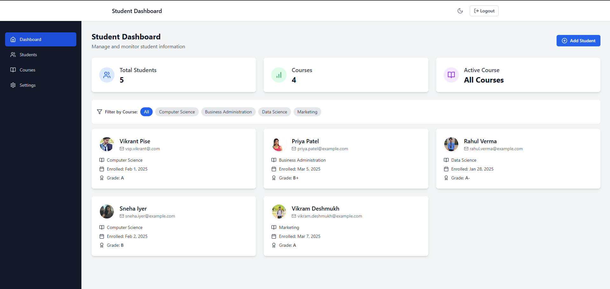

# Student Management Dashboard - Vikrant Pise

A modern, responsive React application for managing student information with Firebase authentication and real-time updates.



## Features

-  **Secure Authentication**: Firebase-based email/password authentication
-  **Responsive Design**: Optimized for both desktop and mobile devices
-  **Dark Mode**: Toggle between light and dark themes
-  **Modern UI**: Clean, card-based interface with smooth transitions
-  **Real-time Updates**: Instant feedback with toast notifications
-  **Advanced Filtering**: Filter students by course
-  **Form Validation**: Comprehensive input validation with error feedback

## Tech Stack

- React 18
- TypeScript
- Vite
- Tailwind CSS
- Firebase Authentication
- React Router DOM
- Formik & Yup
- React Hot Toast
- Lucide React Icons

## Getting Started

### Prerequisites

- Node.js (v18 or higher)
- npm or yarn
- Firebase account

### Installation

1. Clone the repository:
```bash
git clone <repository-url>
cd student-management-dashboard
```

2. Install dependencies:
```bash
npm install
```

3. Create a Firebase project:
   - Go to [Firebase Console](https://console.firebase.google.com/)
   - Create a new project
   - Enable Authentication with Email/Password provider

4. Create a `.env` file in the project root:
```env
VITE_FIREBASE_API_KEY=your_api_key
VITE_FIREBASE_AUTH_DOMAIN=your_auth_domain
VITE_FIREBASE_PROJECT_ID=your_project_id
VITE_FIREBASE_STORAGE_BUCKET=your_storage_bucket
VITE_FIREBASE_MESSAGING_SENDER_ID=your_messaging_sender_id
VITE_FIREBASE_APP_ID=your_app_id
```

5. Start the development server:
```bash
npm run dev
```

The application will be available at `http://localhost:5173`

## Project Structure

```
src/
├── components/         # Reusable UI components
│   ├── auth/          # Authentication related components
│   ├── layout/        # Layout components (sidebar, navbar)
│   ├── students/      # Student management components
│   └── ui/            # Common UI elements
├── context/           # React context providers
├── pages/             # Page components
├── services/          # API and Firebase services
├── types/             # TypeScript type definitions
└── utils/             # Utility functions and validation
```

## Key Features

### Authentication
- Secure email/password authentication
- Protected routes
- Persistent login state
- Demo mode for testing

### Student Management
- View all students in a responsive grid
- Add new students with validation
- Filter students by course
- Real-time updates with toast notifications

### UI/UX
- Responsive design for all screen sizes
- Dark mode support
- Loading states and animations
- Form validation feedback
- Toast notifications for actions
- Card-based layout

## Development

### Available Scripts

- `npm run dev` - Start development server
- `npm run build` - Build for production
- `npm run preview` - Preview production build
- `npm run lint` - Run ESLint

### Environment Variables

Required environment variables:

```env
VITE_FIREBASE_API_KEY
VITE_FIREBASE_AUTH_DOMAIN
VITE_FIREBASE_PROJECT_ID
VITE_FIREBASE_STORAGE_BUCKET
VITE_FIREBASE_MESSAGING_SENDER_ID
VITE_FIREBASE_APP_ID
```

## Contributing

1. Fork the repository
2. Create your feature branch (`git checkout -b feature/amazing-feature`)
3. Commit your changes (`git commit -m 'Add amazing feature'`)
4. Push to the branch (`git push origin feature/amazing-feature`)
5. Open a Pull Request

## License


## Acknowledgments

- [React](https://reactjs.org/)
- [Vite](https://vitejs.dev/)
- [Tailwind CSS](https://tailwindcss.com/)
- [Firebase](https://firebase.google.com/)
- [Lucide Icons](https://lucide.dev/)
